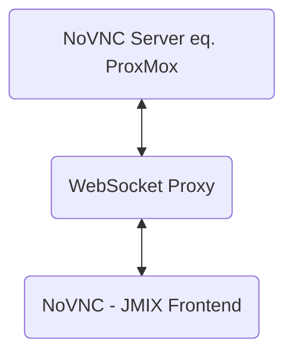

# jmix-vnc
___

**A small JMIX NoVNC implementation enables remote access to virtual desktops via a web browser. This is achieved through an integrated WebSocket relay/proxy that establishes the connection between the NoVNC client and the remote server.**

### Basic Function Principal:

A proxy is required for the use of NoVNC, as NoVNC is executed within the browser and the browser does not support a pure TCP implementation apart from WebSockets. This means that for effective use of NoVNC in network environments that do not allow a direct TCP connection, a proxy server must act as an intermediary to enable communication between the NoVNC client and the remote server. The proxy forwards the WebSocket data packets, which are then converted to TCP format to ensure a seamless connection and interaction with the VNC server.

### Contras:
### **NoVNC does not have any encryption methods such as VenCrypt; a secure TLS connection should be used.**